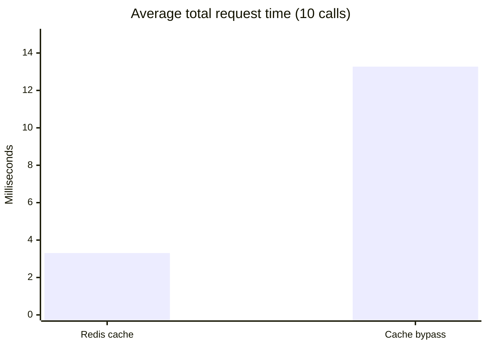

# COMP642 - Group Project
### Team
- Jean Paul Collazo
- Janeth Lucero Garcia Rodriguez
- Daniel Graham

## Application
All dependent components are composable locally with Docker. Simply run the following command at the root of this repo:
`docker compose up -d`

## Components
- Mongo
- Postgres
- Redis
- API (Backend Python FastAPI)
- Web app (Frontend Angular)

The Postgres image creates the tables defined by the SQLAlchemy models in
`api/infrastructure/postgres` and loads synthetic sample records from
`postgres/init.sql` when PostgreSQL initializes a new data
directory. Existing PostgreSQL data volumes are not reinitialized.

## Project Deliverables
### Part A
- See `postgres/init.sql` for the tables and 8 required queries. This file is what is used by Docker to create the database and tables and seed the data. The queries are commented out at the end for reference.
- See the endpoint defined in `api/services/orders_router.py` the `create_order` method that serves the `POST /orders` endpoint which demonstrates the transaction / rollback requirement.
- See the endpoint defined in `api/services/executesql_router.py` the `executesql` method that allows for the running of given queries (the frontend will facilitate the running of the 8 defined queries).

### Part B
See `/mongo/mongo-init.js` for the creation of the database and collection. This is also where you'll find the datbase collection being seeded with flexible data representing metadata enrichment for events, specifically `Description`, `Speakers`, `Schedule`, `Reviews`, and `Tags`. This file meets the following requirements:
- `insertOne()` and `insertMany()`
- Indexing
- Arrays
- Nested documents

See the endpoint defined in `api/services/events_router.py` the `get_event_content` method to see the use of `find()`.

See the endpoint defined in `api/services/events_router.py` the `create_event_review` method to see the use of Updates.

See the endpoint defined in `api/services/events_router.py` the `delete_event_reviews` method to see the use of Deletes.

See the following endpoints defined in `api/services/events_router.py` to see demonstrations of the following queries (which also demonstrates use of projections, comparison and boolean operators, dot notation, and $elemMatch):
- Find events containing a particular tag (method `find_events_by_tag`).
- Find events featuring a particular speaker (method `find_events_by_speaker`).
- Find events with reviews above a specified rating (method `find_events_by_review_rating`).
- Find events containing particular combinations of nested attributes (method `find_events_by_nested_attributes`).
- Find concerts belonging to a particular genre (method `find_concerts_by_genre`).

### Part C
#### Use Case 1
See the endpoint defined in `api/services/events_router.py` the `get_event` method to see the caching pattern using a 1 minute TTL. Calls to this method also increment a counter in Redis for the given event id. Add `?bypass_cache=true` to the event URL to skip reading from or writing to the event cache.

#### Use Case 2
See the endpoint defined in `api/services/events_router.py` the `get_trending_events` method to see us grabbing the top 10 trending events by score from Redis.

### Performance Experiment
Using the endpoint `/events/{id}` I ran a script that called it 10 times as is (which will utilize the Redis cache by default) and then 10 times passing in the querystring `bypass_cache=True` so that it would force itself to bypass the Redis cache and pull the data directly from Postgres and MongoDB.

#### Experiment A (bypass Redis cache)
|Call #| Total Time (ms) |
| --- | --- |
|1| 16.087|
|2| 15.710|
|3| 14.457|
|4| 12.692|
|5| 13.643|
|6| 11.793|
|7| 12.439|
|8| 12.487|
|9| 11.269|
|10| 12.156|

#### Experiment B (using Redis cache)
|Call #| Total Time (ms) |
| --- | --- |
|1| 4.339|
|2| 3.016|
|3| 3.113|
|4| 3.315|
|5| 3.400|
|6| 2.896|
|7| 3.603|
|8| 2.802|
|9| 3.180|
|10| 3.411|

#### Report

|Metric|Database|Redis|
|---|---|---|
|Minimum| 11.269 ms| 2.802 ms|
|Maximum| 16.087 ms| 4.339 ms|
|Average| 13.273 ms| 3.308 ms|
|Median | 12.590 ms| 3.248 ms|

#### Visualization of Results

#### Explainations
- The performance differs between the cached and non-cached calls because of the work that's involved within each database when requesting data (e.g. in the RDBMS, it must compile the SQL, formulate an explain plan, and execute). There's also the matter that there are 2 sequential database calls being made when not hitting the cache which is always going to take longer than the single call to Redis. Overall the general reasoning here is that when hittng Redis, the api is having to do far less work as is Redis itself in comparison to the sequential database calls.
- Caching is useful because it can not only improve overall response times (resulting in a better UX for end users) but it can make your TCO much lower as it can lessen the load of your system overall (less memory pressure on your databases, less overall compute and IOPS costs if hosting on the cloud).
- Caching creates problems when the data being cached is updated often. Every time a data element is updated, anywhere that element is cached, that cache needs to be invalidated. This is a classic challenge for software engineers. The problem is exacerbated when the payload / class data is larger and / or more complex.
- I chose a TTL of one minute because for the purposes of this project, I felt like that was a reasonable time to wait in order to see the cache expire for debugging and demonstration purposes. In a real-world production scenario, depending on the volatility of the data, I would most likely choose a higher / longer TTL. 